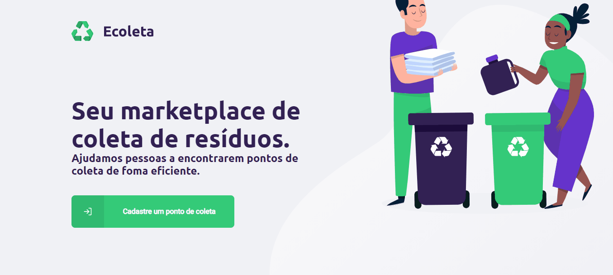

<h3 align="center">
    
      
    <b>Recycle! help the environment!</b>  
     
</h3>

  <a>
  
  
  
   

# Index

- [About](#about)
- [Technologies](#technologies)
- [Result](#result)

## :bookmark: About

<strong>Ecoleta</strong> is an app to help people find collection points for recycling.

## :rocket: Technologies

The project has been created using the following technologies.

- [TypeScript](https://www.typescriptlang.org/)
- [Node.js](https://nodejs.org/en/)
- [ReactJS](https://reactjs.org/)
- [React Native](https://reactnative.dev/)

## :heavy_check_mark: Result:

<h1 align="center" id="result">
    
</h1>
